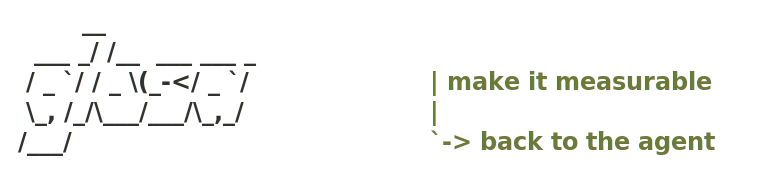
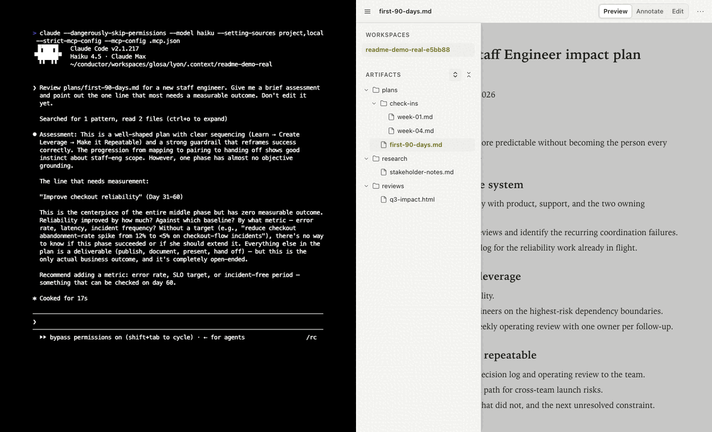

<div align="center">

<picture>
  <source media="(prefers-color-scheme: dark)" srcset="docs/assets/glosa-wordmark-dark.svg">
  <source media="(prefers-color-scheme: light)" srcset="docs/assets/glosa-wordmark-light.svg">
  
</picture>

<p><strong>The review surface for writing with coding agents.</strong></p>

<p>
  Read Markdown, HTML, and text as documents. Annotate exact passages, edit source,<br>
  and route feedback back to Claude Code or Codex without moving the work to a cloud service.
</p>

<p><sub>macOS 13+ &nbsp;·&nbsp; Bun 1.2.7+ &nbsp;·&nbsp; local-first &nbsp;·&nbsp; Apache-2.0</sub></p>

</div>

> [!WARNING]
> **glosa is an experimental public alpha.** Back up important work. The deterministic acceptance
> suites pass, but the final maintainer-reviewed compatibility rehearsal and token-revocation check
> are not yet approved for a live document week.

<picture>
  <source media="(prefers-reduced-motion: reduce)" srcset="docs/assets/glosa-review-loop.png">
  
</picture>

Writing in a terminal is fine. Reviewing a long document there is not. glosa gives the document its
own surface while the agent remains a normal interactive session in your terminal.

```text
agent drafts -> glosa renders -> you annotate or edit -> feedback reaches the bound session -> revision returns
```

## What glosa does

| Surface | What it is for |
|---|---|
| **Preview** | Read rendered Markdown, trusted text, or isolated HTML without terminal noise. |
| **Annotate** | Select a passage and attach content, classification, or presentation feedback to its durable source anchor. |
| **Edit** | Change the source directly; glosa saves and re-renders it as a human edit. |
| **History** | Compare versions and restore an earlier checkpoint without touching your repository's Git history. |

The workspace sidebar preserves directory nesting across mixed artifacts. Multiple workspaces can be
open at once, and feedback waits durably when no matching agent session is live.

## Quick start

Install the alpha CLI globally:

```sh
bun add --global @davebream/glosa@alpha
```

Set up the agent integration once in a writing workspace, then open it:

```sh
cd /path/to/your/workspace
glosa init
glosa open
```

`glosa init` installs workspace-local hooks and MCP configuration. `glosa open` starts or reuses the
singleton daemon and opens a paired browser tab. Run `glosa doctor` to verify the integration, or
`glosa --help` to see every command.

> [!NOTE]
> A durable global install is required for `glosa init`: generated hooks must keep working after the
> current shell exits. `bunx` and `npx` remain suitable for one-shot commands.

## Agent support

| Agent | Integration |
|---|---|
| **Claude Code** | Hooks, MCP pull, turn-boundary delivery, and optional Channels push when the installed build supports it. |
| **Codex** | Hooks, MCP pull, and turn-boundary delivery through the same provider contract. |
| **Generic MCP host** | Durable feedback can be pulled through the MCP tools without teaching the core about that agent. |

glosa binds feedback to an explicit live session when possible. If more than one session matches, the
browser asks instead of guessing. If none is live, the entry parks until a matching session registers.

## Local by design

- The daemon binds to `127.0.0.1`; the browser API is bearer-authenticated and protected against DNS rebinding.
- glosa has no telemetry, cloud sync, or external runtime calls. Your agent may still send content to its own provider under that tool's terms.
- Versions live in a workspace-local shadow repository. glosa never assumes or modifies your real Git repository.
- Provenance is conservative: edits are attributed to a session only when an apply lease proves it; everything else is `human` or `unknown`, never guessed.

If a local bearer token may have leaked, run `glosa token revoke`, then `glosa open <directory>` to
create and pair a replacement. Use `glosa token rotate` for immediate replacement. Token commands
never print credential material.

Report vulnerabilities through [GitHub private vulnerability reporting](https://github.com/davebream/glosa/security/advisories/new),
not a public issue. See [SECURITY.md](SECURITY.md).

## How it is built

```text
Claude Code / Codex
        |
  hooks + MCP
        |
  glosa daemon -------- browser workspace
        |
 workspace files + append-only journal + shadow history
```

glosa is a Bun + TypeScript monorepo with one daemon serving a small vanilla-JS SPA. The core is
agent- and domain-agnostic: agent knowledge belongs in providers, while artifact metadata enters
through a declarative adapter boundary. The append-only journal is the source of truth for every
feedback lifecycle.

Start with [the requirements](docs/requirements.md) for the normative contract, [the roadmap](ROADMAP.md)
for accepted direction, and [the decision log](docs/decisions.md) for the reasoning behind the design.

## Development

```sh
bun install --frozen-lockfile
bun run setup:hooks
bun run typecheck
bun test
bun run audit:licenses
bun run package:check
```

Read [CONTRIBUTING.md](CONTRIBUTING.md) and the [Code of Conduct](CODE_OF_CONDUCT.md) before opening a
pull request. The project is licensed under the [Apache License 2.0](LICENSE); see [NOTICE](NOTICE) and
[THIRD_PARTY_NOTICES.md](THIRD_PARTY_NOTICES.md) for attribution details.
