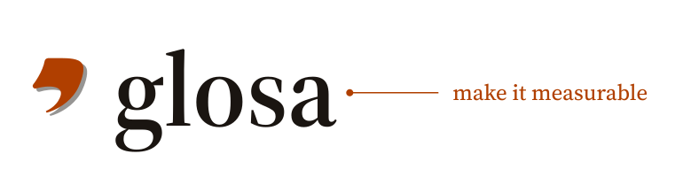
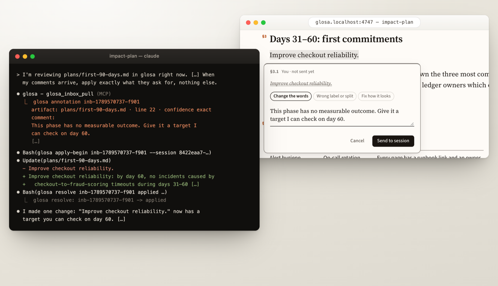
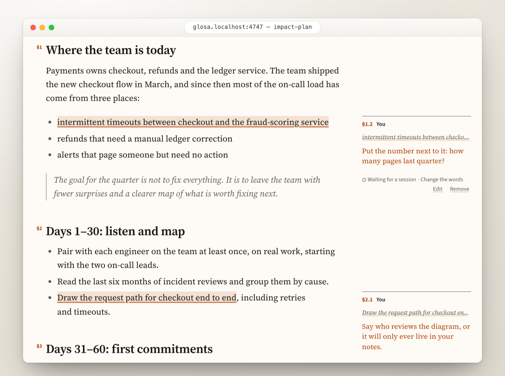
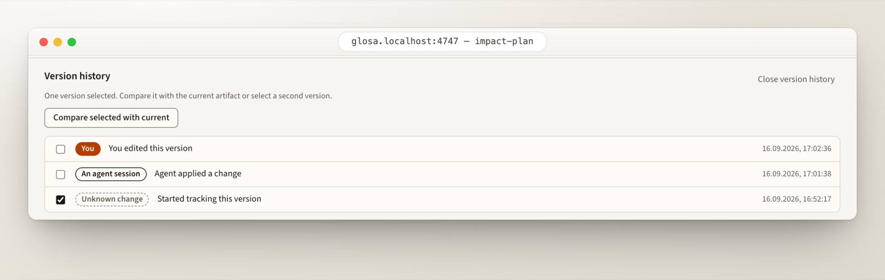
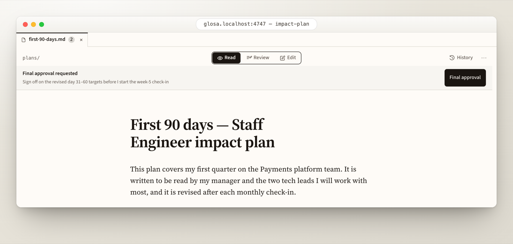

<div align="center">

<picture>
  <source media="(prefers-color-scheme: dark)" srcset="docs/assets/glosa-wordmark-dark.svg">
  <source media="(prefers-color-scheme: light)" srcset="docs/assets/glosa-wordmark.svg">
  
</picture>

<p><strong>The review surface for writing with coding agents.</strong></p>

<p>
  Read Markdown, HTML, and text as documents. Annotate exact passages, edit source,<br>
  and route feedback back to Claude Code or Codex without moving the work to a cloud service.
</p>

<p><sub>macOS 13+ &nbsp;·&nbsp; Bun 1.2.7+ &nbsp;·&nbsp; local-first &nbsp;·&nbsp; Apache-2.0</sub></p>

</div>

> [!WARNING]
> **glosa is an experimental public alpha.** Back up important work. The deterministic acceptance
> suites pass, but the final maintainer-reviewed compatibility rehearsal and token-revocation check
> are not yet approved for a live document week.

<picture>
  <source media="(prefers-color-scheme: dark)" srcset="docs/assets/screens/hero-dark.png">
  <source media="(prefers-color-scheme: light)" srcset="docs/assets/screens/hero-light.png">
  
</picture>

The agent keeps its terminal. The document gets a surface. A comment you write in the margin arrives
in that session as anchored feedback — with the file, the line, and the anchor confidence.

Writing in a terminal is fine. Reviewing a long document there is not. glosa gives the document its
own surface while the agent remains a normal interactive session in your terminal.

```text
agent drafts -> glosa renders -> you annotate or edit -> feedback reaches the bound session -> revision returns
```

## What glosa does

| Surface | What it is for |
|---|---|
| **Preview** | Read rendered Markdown, trusted text, or isolated HTML without terminal noise. |
| **Annotate** | Select a passage and attach content, classification, or presentation feedback to its durable source anchor. |
| **Edit** | Change the source directly; glosa saves and re-renders it as a human edit. |
| **History** | Compare versions and restore an earlier checkpoint without touching your repository's Git history. |

The workspace sidebar preserves directory nesting across mixed artifacts. Multiple workspaces can be
open at once, and feedback waits durably when no matching agent session is live.

### Comments stay attached to the words they are about

<picture>
  <source media="(prefers-color-scheme: dark)" srcset="docs/assets/screens/annotate-dark.png">
  <source media="(prefers-color-scheme: light)" srcset="docs/assets/screens/annotate-light.png">
  
</picture>

Each comment is stored against a durable source anchor — the quoted text plus its surrounding
context — not a line number that the next revision invalidates. Entries wait in the workspace journal
until a matching agent session picks them up, so nothing is lost when no session is running.

### Every revision is a version you can read and undo

<picture>
  <source media="(prefers-color-scheme: dark)" srcset="docs/assets/screens/history-dark.png">
  <source media="(prefers-color-scheme: light)" srcset="docs/assets/screens/history-light.png">
  
</picture>

History lives in a workspace-local shadow repository, so restoring an earlier version never touches
your project's Git history. Attribution is deliberately conservative: edits made in glosa's own
editor are yours by construction, and a change glosa did not witness through an apply lease stays
`Unknown change` rather than being credited to anyone.

### An agent can stop and wait for your verdict

<picture>
  <source media="(prefers-color-scheme: dark)" srcset="docs/assets/screens/approval-dark.png">
  <source media="(prefers-color-scheme: light)" srcset="docs/assets/screens/approval-light.png">
  
</picture>

`glosa request-review <path> --require-approval --wait 30m` blocks in the agent's terminal until you
approve or reject that saved revision in the browser, then returns the verdict to the waiting
command. Without `--wait` the request parks in the inbox for later.

## Quick start

Install the alpha CLI globally:

```sh
bun add --global @davebream/glosa@alpha
```

Do not use the `davebream/glosa` GitHub shorthand: it installs the repository's moving default branch
rather than the published alpha.

<details>
<summary>If your npm config maps the <code>@davebream</code> scope to another registry</summary>

glosa is published to the public npm registry. A scope mapping in `~/.npmrc` — for example
`@davebream:registry=https://npm.pkg.github.com` — redirects the install and produces a 404. A scope
mapping outranks the `--registry` flag, and bun has no scoped-registry flag at all, so
`--registry=https://registry.npmjs.org/` does **not** fix this.

Install from the published tarball URL, which resolves without consulting any registry configuration:

```sh
bun add --global https://registry.npmjs.org/@davebream/glosa/-/glosa-0.1.0-alpha.9.tgz
```

Or, with npm, use the scoped form — which does beat a scope mapping:

```sh
npm install -g --@davebream:registry=https://registry.npmjs.org/ @davebream/glosa@alpha
```

After the first install, `glosa update` handles this automatically.

</details>

Open a writing workspace first; install agent delivery only when you want feedback routed back:

```sh
cd /path/to/your/workspace
glosa open
glosa init --agent claude-code
```

`glosa init` defaults to workspace scope and accepts repeatable `--agent claude-code|codex` flags
(`--agent all` installs both). Without a flag it selects one locally detected provider or prompts
once when interactive; scripts and `--json` callers must resolve ambiguity explicitly. Use
`--scope user` for a user-wide integration. Preview-only `glosa open` and `glosa_present` do not
require init or an agent session. Run `glosa doctor` to verify effective provider installations,
or `glosa --help` to see every command.

### Updating

```sh
glosa update           # upgrade in place
glosa update --check   # report what would change, install nothing
```

`glosa update` resolves the release over a plain HTTPS request that reads no npm configuration, verifies
the downloaded tarball against the registry's published sha512, and installs it through whichever package
manager owns your glosa install. It is the only part of glosa that makes an outbound network request, it
runs only when you invoke it, and it sends no identifying data.

> [!NOTE]
> A durable global install is required for `glosa init`: generated hooks must keep working after the
> current shell exits. `bunx` and `npx` remain suitable for one-shot commands.

## Agent support

| Agent | Integration |
|---|---|
| **Claude Code** | Hooks, MCP pull, turn-boundary delivery, and optional Channels push when the installed build supports it. |
| **Codex** | Hooks, MCP pull, and turn-boundary delivery through the same provider contract. |
| **Generic MCP host** | Durable feedback can be pulled through the MCP tools without teaching the core about that agent. |

glosa binds feedback to an explicit live session when possible. If more than one session matches, the
browser asks instead of guessing. If none is live, the entry parks until a matching session registers.

## Related tools

glosa is one part of a useful ecosystem of human-in-the-loop tools. These projects solve adjacent
problems well; use the one that best fits the work.

| Project | Reach for it when | How glosa differs |
|---|---|---|
| [Plannotator](https://github.com/backnotprop/plannotator) | You want a mature, on-demand review surface for plans, documents, HTML, code diffs, or pull requests, with broad agent support and optional sharing. | glosa treats a directory as a long-lived writing workspace. Its journal, parked feedback, shadow history, and conservative provenance are designed to survive changes across files, tools, and agent sessions. It deliberately has no sharing service or runtime network egress. |
| [Agentation](https://github.com/benjitaylor/agentation) | You are reviewing a running React interface and want element, area, or text annotations with selectors an agent can act on. | glosa reviews file-backed Markdown, HTML, and text, then routes durable feedback through agent hooks and MCP. It does not embed a feedback toolbar in the application being reviewed. |

Plannotator is the closest neighboring project and a strong place to start for established plan,
document, or code review today. glosa is exploring a narrower question: can a sensitive writing
workspace remain local, durable, and honestly attributable across many artifacts and agent sessions?

## Local by design

- glosa listens only on your Mac. `glosa open` pairs your browser tab with the local API, and requests routed through other websites are rejected ([security model](docs/appendices/A3-security.md)).
- glosa has no telemetry, cloud sync, or external runtime calls. Your agent may still send content to its own provider under that tool's terms.
- Versions live in a workspace-local shadow repository. glosa never assumes or modifies your real Git repository.
- Provenance is conservative: edits are attributed to a session only when an apply lease proves it; everything else is `human` or `unknown`, never guessed.

If a local bearer token may have leaked, run `glosa token revoke`, then `glosa open <directory>` to
create and pair a replacement. Use `glosa token rotate` for immediate replacement. Token commands
never print credential material.

Report vulnerabilities through [GitHub private vulnerability reporting](https://github.com/davebream/glosa/security/advisories/new),
not a public issue. See [SECURITY.md](SECURITY.md).

## How it is built

```text
Claude Code / Codex
        |
  hooks + MCP
        |
  glosa daemon -------- browser workspace
        |
 workspace files + append-only journal + shadow history
```

glosa is a Bun + TypeScript monorepo with one daemon serving a small vanilla-JS SPA. The core is
agent- and domain-agnostic: agent knowledge belongs in providers, while artifact metadata enters
through a declarative adapter boundary. The append-only journal is the source of truth for every
feedback lifecycle.

Start with [the requirements](docs/requirements.md) for the normative contract, [the roadmap](ROADMAP.md)
for accepted direction, and [the decision log](docs/decisions.md) for the reasoning behind the design.

## Development

```sh
bun install --frozen-lockfile
bun run setup:hooks
bun run typecheck
bun test
bun run audit:licenses
bun run package:check
```

Read [CONTRIBUTING.md](CONTRIBUTING.md) and the [Code of Conduct](CODE_OF_CONDUCT.md) before opening a
pull request. The project is licensed under the [Apache License 2.0](LICENSE); see [NOTICE](NOTICE) and
[THIRD_PARTY_NOTICES.md](THIRD_PARTY_NOTICES.md) for attribution details.
