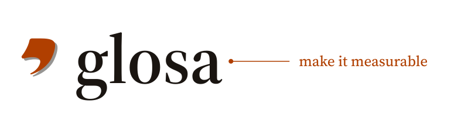
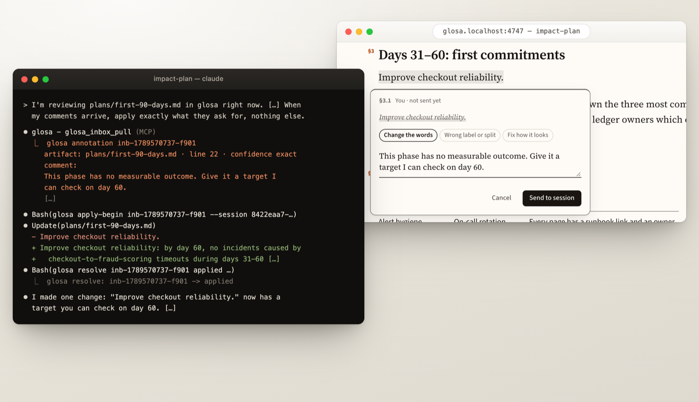
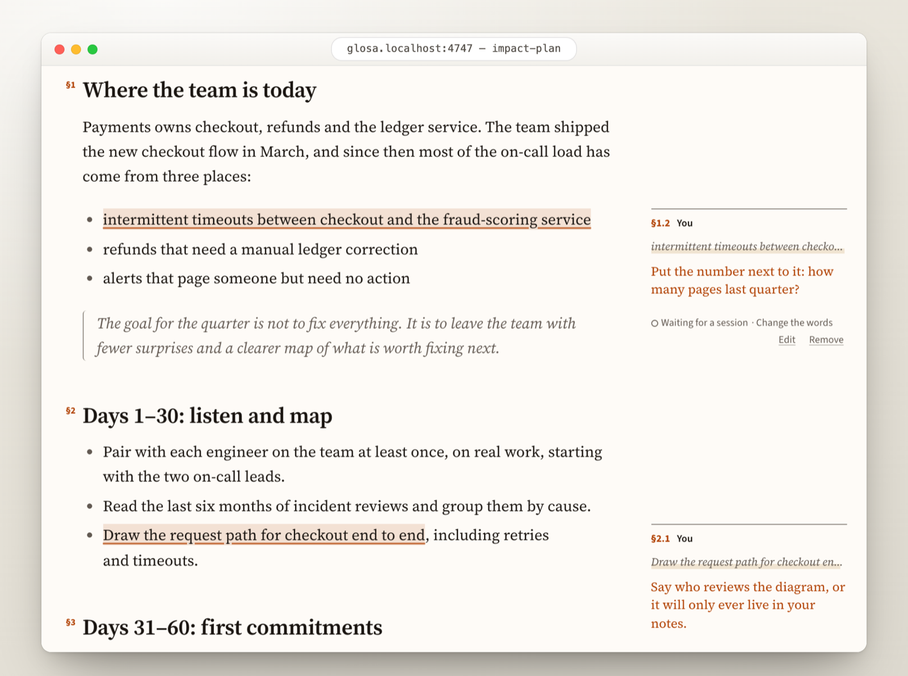
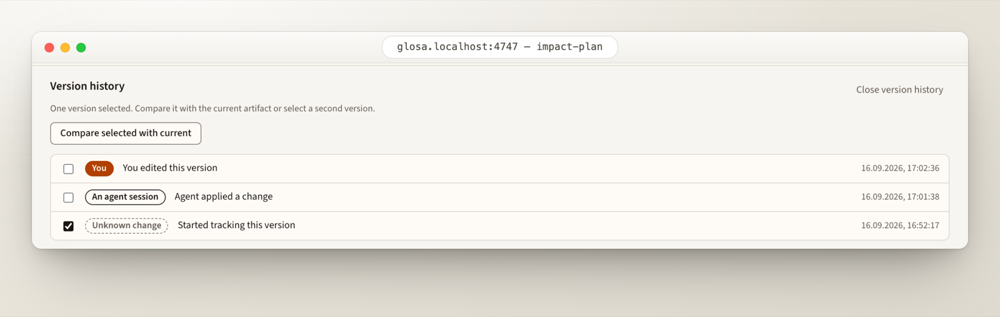
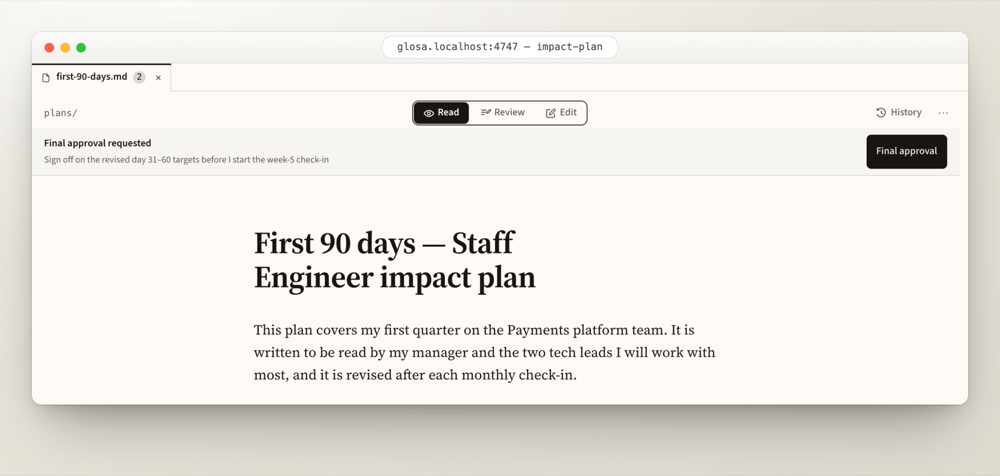

<div align="center">

<picture>
  <source media="(prefers-color-scheme: dark)" srcset="docs/assets/glosa-wordmark-dark.svg">
  <source media="(prefers-color-scheme: light)" srcset="docs/assets/glosa-wordmark.svg">
  
</picture>

<p><strong>A calm place to read and review what your coding agent writes.</strong></p>

<p>
  Read Markdown, HTML and text as documents. Mark exact passages, edit the source,<br>
  and send your notes back to Claude Code or Codex without moving the work to a cloud service.
</p>

<p><sub>macOS 13+ &nbsp;·&nbsp; experimental Linux CLI &nbsp;·&nbsp; local-first &nbsp;·&nbsp; Apache-2.0</sub></p>

<p><a href="#install">Install</a> · <a href="https://github.com/davebream/glosa/releases">Downloads</a> · <a href="#connect-your-agent">Connect your agent</a> · <a href="#documentation">Documentation</a></p>

</div>

> [!WARNING]
> **glosa is an experimental public alpha.** Back up important work. The deterministic acceptance
> suites pass and token rotation and revocation have shipped. Maintainer sign-off on the real-session
> compatibility rehearsal is still pending, so glosa is not yet approved for a live document week.

## Install

### macOS desktop app (recommended)

On macOS 13 or newer, install with [Homebrew](https://brew.sh):

```sh
brew install --cask davebream/tap/glosa
```

The app includes Bun and the `glosa` command line. You do not need a separate Bun or Node install.
Git 2.30 or newer must be available. Homebrew also puts `glosa` on your terminal’s path.

**Without Homebrew:** [download a DMG from Releases](https://github.com/davebream/glosa/releases),
open it and drag **glosa.app** into **Applications**. Choose the file for your Mac:

| Your Mac | File ending |
|---|---|
| Apple Silicon (M-series) | `-arm64.dmg` |
| Intel | `-x64.dmg` |

Current macOS builds are not notarized. If macOS blocks the app or its bundled command line, allow
this install after installing or upgrading:

```sh
xattr -dr com.apple.quarantine /Applications/glosa.app
```

If macOS refuses that command, allow your terminal under **System Settings → Privacy & Security →
App Management**, then retry. [More launch help](docs/release.md#ad-hoc-or-notarized).

For a terminal-only install or experimental Linux support, see [CLI only](#cli-only).

### Open your first workspace

Open **glosa** from Applications and choose a folder. With the Homebrew install, you can also open
the current folder from your terminal:

```sh
cd /path/to/your/workspace
glosa open
```

The app works for reading and editing without an agent session. To send notes back to Claude Code
or Codex, [connect your agent](#connect-your-agent). Run `glosa doctor` if opening fails.

## Documentation

| You want to | Start here |
|---|---|
| Connect Claude Code or Codex | [Agent setup](#connect-your-agent) |
| Install just the CLI or check Linux support | [CLI only](#cli-only) · [Platform support](#platform-support) |
| Upgrade or fix a competing install | [Updates and troubleshooting](#updates-and-troubleshooting) |
| Read what changed | [Changelog](CHANGELOG.md) |
| Understand privacy or contribute | [Security](SECURITY.md) · [Contributing](CONTRIBUTING.md) |

<picture>
  <source media="(prefers-color-scheme: dark)" srcset="docs/assets/screens/hero-dark.png">
  <source media="(prefers-color-scheme: light)" srcset="docs/assets/screens/hero-light.png">
  
</picture>

The agent keeps its terminal and the document gets its own page. Select a passage, write a note under
it, and the note reaches that session as anchored feedback: the file, the line and how confidently
glosa matched the words.

Writing in a terminal works. Reviewing a long document there does not. glosa renders the document
beside the agent, which stays a normal interactive session in your terminal.

```text
agent drafts -> glosa renders -> you mark or edit -> the note reaches the bound session -> the revision comes back
```

## What glosa does

| On the page | What it is for |
|---|---|
| **Reading and notes** | A document opens rendered, with the margin beside it. Select words and a note opens right under them; your notes and a session's questions sit beside the passages they are about. **Notes** hides the margin when you just want to read. |
| **Edit** | **Edit** (⌘E) turns the same page into an editor, rich or exact source, and **Done** turns it back. glosa saves only the blocks you changed and records the edit as yours. |
| **Go to** | The document's path in the top bar, or ⌘K, jumps to a section or a file, or runs a command such as hiding notes. |
| **History** | Compare versions and restore an earlier one without touching your repository's Git history. |

Each document can be set in a style from its own menu: Editorial (serif), Spec (a denser sans for
specifications) or Mono, and a folder can have a default style. The sidebar keeps your directory
structure across mixed files, several workspaces can be open at once, and notes wait safely when no
matching agent session is running.

### Notes stay attached to the words they are about

<picture>
  <source media="(prefers-color-scheme: dark)" srcset="docs/assets/screens/annotate-dark.png">
  <source media="(prefers-color-scheme: light)" srcset="docs/assets/screens/annotate-light.png">
  
</picture>

Each note is stored against the quoted words and a little context on either side, not a line number
that the next revision breaks. If the passage changes so much that glosa can no longer find it, the
note says so ("Lost its place") instead of pointing somewhere wrong. Notes wait in the workspace
journal until a matching agent session picks them up, so nothing is lost while no session is running.

### Every revision is a version you can read and undo

<picture>
  <source media="(prefers-color-scheme: dark)" srcset="docs/assets/screens/history-dark.png">
  <source media="(prefers-color-scheme: light)" srcset="docs/assets/screens/history-light.png">
  
</picture>

History lives in a shadow repository that glosa keeps apart from your project's, so restoring a
version never touches your project's Git history.

Attribution is deliberately conservative:

- an edit made in glosa's own editor is yours;
- a change is credited to an agent session only when the session held an apply lease for that note;
- anything else stays `Unknown change` rather than being credited to anyone.

Edit a tracked file in another editor and glosa records exactly that: the file changed outside glosa,
attributed to nobody. It appears in your inbox as information, not a task. No agent is nudged about
it unless its own session asked to watch for outside changes, and it stays until you dismiss it.

If checkpoint storage is damaged, `glosa doctor --workspace <slug>` reports it and counts inbox entries
that reference missing history. `glosa doctor --workspace <slug> --repair-baseline` starts a new
baseline from the current tracked files so later saves are captured again. It leaves your files and
surviving history alone, and it cannot bring back lost checkpoints.

### An agent can stop and wait for your verdict

<picture>
  <source media="(prefers-color-scheme: dark)" srcset="docs/assets/screens/approval-dark.png">
  <source media="(prefers-color-scheme: light)" srcset="docs/assets/screens/approval-light.png">
  
</picture>

`glosa request-review <path> --require-approval --wait 30m` blocks in the agent's terminal until you
approve or reject that saved revision in the browser, then hands the verdict back to the waiting
command. Without `--wait`, the request waits in the inbox for later.

## Connect your agent

Add the official marketplace and install the Claude Code plugin once:

```text
/plugin marketplace add davebream/glosa
/plugin install glosa
```

For Codex, register the MCP server once:

```sh
codex mcp add glosa -- glosa mcp
```

There is no `glosa init`. glosa never changes an agent’s configuration on its own.

The plugin supplies Claude's MCP tools and one session monitor per session. A session started
outside a glosa workspace stays idle; once `glosa open` registers that directory, the same monitor
connects without restarting the session. A session that installed the plugin after it began has no
monitor yet, so running the `glosa-connect` skill starts one. Whichever route starts it, only
one ever runs for a session. Read-only `glosa open --read` and `glosa_present` do not need an agent
session.

## CLI only

The macOS Homebrew formula installs the command line and Bun:

```sh
brew install davebream/tap/glosa
```

Choose either the desktop cask or the formula. Both link `glosa` into Homebrew’s bin, so installing
both conflicts; the desktop app already includes the CLI.

Alternatively, on macOS or experimental Linux x86_64/glibc, install the alpha CLI with
[Bun](https://bun.com/docs/installation):

```sh
bun add --global @davebream/glosa@alpha
```

This route requires Git 2.30+ and Bun 1.2.7+ on macOS or Bun 1.4.2+ on Linux. Linux desktop packages
are not published yet; [qualification remains pending](docs/compatibility/linux-qualification.md).
Use `glosa open` from your workspace folder as above.

Use a durable global install for agent integration. `bunx` and `npx` suit one-off commands.
The `davebream/glosa` GitHub shorthand installs the moving source branch, rather than the published
alpha package.

## Updates and troubleshooting

| Installed through | Upgrade command |
|---|---|
| Homebrew desktop cask | `brew upgrade --cask glosa` |
| Homebrew CLI formula | `brew upgrade glosa` |
| Bun or npm | `glosa update` |

```sh
glosa update           # upgrade in place
glosa update --check   # report what would change, install nothing
```

`glosa update` fetches the release over a plain HTTPS request that reads no npm configuration, checks
the downloaded tarball against the registry's published sha512, and installs it through whichever
package manager owns your glosa install; the desktop app on macOS and the pacman package on Linux
are updated by Homebrew and pacman instead, and `glosa update` says the exact command. It runs only when you invoke it and sends no identifying
data. The desktop app's Check for Updates…, in the glosa menu, makes the same kind of request only
when you click it, asking GitHub which app releases exist; it tells you whether a newer one is out
and installs nothing. The other optional external action is configured dictation, which starts only
when you click the microphone icon and sends only the data named in its consent disclosure.

<details>
<summary>An older CLI is still selected after installing the desktop app</summary>

To make the app's bundled CLI the lasting owner when a bun or npm install is already recorded, stop
that install's daemon, then run the bundled CLI directly:

```sh
/Applications/glosa.app/Contents/Resources/bin/glosa install select
```

If its daemon is still running, the command refuses and names the verified PID and stop command.
The selection stays in place even if the old terminal CLI runs later. `glosa doctor` shows the owner;
`glosa install auto` restores automatic recording. If the app has been removed, run `install auto`
through another current CLI's full path, since the selected app launcher is then unavailable.

</details>

<details>
<summary>If your npm config maps the <code>@davebream</code> scope to another registry</summary>

glosa is published to the public npm registry. A scope mapping in `~/.npmrc`, for example
`@davebream:registry=https://npm.pkg.github.com`, redirects the install and produces a 404. A scope
mapping outranks the `--registry` flag, and bun has no scoped-registry flag at all, so
`--registry=https://registry.npmjs.org/` does **not** fix this.

Install from the published tarball URL, which resolves without consulting any registry configuration:

```sh
bun add --global https://registry.npmjs.org/@davebream/glosa/-/glosa-0.1.0-alpha.42.tgz
```

Or, with npm, use the scoped form, which does beat a scope mapping:

```sh
npm install -g --@davebream:registry=https://registry.npmjs.org/ @davebream/glosa@alpha
```

After the first install, `glosa update` handles this automatically.

</details>

## Platform support

| Platform | Status |
|---|---|
| macOS 13 or newer, Apple Silicon and Intel | Supported. Every release is tested here. |
| Linux x86_64 with glibc | Experimental CLI and daemon. Requires Bun 1.4.2+ and Git 2.30+. A pacman package of the desktop app for Arch and Manjaro is built and tested in containers; releasing it and native qualification of managed chats and dictation remain pending ([#430](https://github.com/davebream/glosa/issues/430)). |
| Windows | Not supported and not planned for now. The local API socket, the file permission model and the Claude Code plugin launcher are POSIX only. |

Managed Claude and Codex chats can be enabled separately in Agents & accounts on supported macOS
and Linux hosts. This is an off-by-default experimental choice for the pinned runtime. It does not
qualify that runtime or the Linux desktop package; native account, process and release checks remain
pending. Terminal companion sessions are unaffected.

`glosa open`, `glosa doctor`, `glosa update` and MCP startup refuse unsupported OS/architecture,
libc or Bun versions with exit code 5 before daemon startup or network access. macOS keeps its
Bun 1.2.7 minimum; Linux requires Bun 1.4.2. Windows, Linux ARM and musl are not supported.

On Linux, use the [CLI-only installation](#cli-only) and `glosa open`. Browser launch uses
`xdg-open`; install your distribution's `xdg-utils` package for desktop use. If launch fails or
cannot be confirmed within five seconds, glosa keeps the workspace registered and prints its URL
with a warning. `glosa open --url <path>` works without a graphical session or opener. Open the
link within 60 seconds; run the command again for a fresh link. The Ubuntu Linux checks select core,
deterministic acceptance and real Electron security tests; installed-app qualification on Manjaro remains pending. Pinned Linux
Claude/Codex runtimes are installable candidates, not qualified native sessions; managed execution
requires explicit experimental acceptance and remains unqualified.

## Everyday use

- `glosa doctor` diagnoses the daemon and the session monitor; `glosa --help` lists every command.
- `glosa inbox list` names an inbox entry whose file was moved or deleted by hand, and
  `glosa inbox dismiss <id>` closes it without a session.
- `glosa forget <slug> [--yes]` permanently deletes a workspace's registration and history, never your
  files. It refuses while a live session or apply lease is active and previews the exact paths first.
- `glosa open --document <file>` opens one document with no file navigator. Its link also works in an
  open workspace tab: unsaved edits need a discard confirmation first, and cancelling keeps the draft.

### Dictation (optional)

- **Settings → Dictation** accepts your OpenAI API key and explicit consent. Dictation starts off;
  visible context starts on and optional text cleanup starts off. Click the microphone icon in an
  annotation, review reply, conversation or attention reply, then click Stop to transcribe.
  English, Polish, German and Spanish are detected automatically, including mixed-language speech.
  Text stays in the draft until you send it. Recording is limited to 5m45s and 12 MiB.
- Keys stay in macOS Keychain or Linux Secret Service, never browser storage or a plaintext config.
  Linux needs `libsecret`, `systemd` utilities and an initialized desktop wallet such as KWallet.
  Unlock a locked wallet in its manager and retry. Saving settings and checking status make no
  OpenAI request. OpenAI API billing is separate from ChatGPT and Wispr subscriptions.
  CLI equivalents are `glosa dictation configure --provider openai`, `glosa dictation status`
  and `glosa dictation disable`. Local transcription models are a future option.

## Agent support

| Agent | Integration |
|---|---|
| **Claude Code** | Official plugin with MCP pull and a per-session monitor over the generic push stream. The monitor starts at session start, or when `glosa-connect` runs in a session that began without the plugin. |
| **Codex** | App-server push when its local control socket is running, with MCP pull as the fallback. Binding a session is what starts the attachment. |
| **Generic MCP host** | Notes can be pulled through the MCP tools without teaching glosa's core about that agent. |

glosa binds notes to an explicit live session when it can. If more than one session matches, the
browser asks you instead of guessing. If none is live, the note waits until a matching session
registers.

A running session survives a daemon restart: its next MCP tool call registers it again. To restore an
explicit connection, use `glosa_session_bind` or `glosa session bind <session-id> --workspace <path>`.
Binding also registers an unknown session, so the agent does not need a restart.

Claude Code's session identity comes from its session environment. Codex's MCP process receives no
thread identity, so the agent reads `CODEX_THREAD_ID` in its shell and passes it with MCP
`provider:"codex"`. On the CLI, `--provider <id>` supplies identity explicitly. Without any provider
evidence, binding uses a generic MCP session.

A missing transcript only affects the conversation mirror. Open session streams keep the session lease
alive; once they close, the lease expires after its remaining time. Whether a session holds one right
now is reported per session by `glosa status --json` and named by `glosa doctor`, because being bound
and being reachable by push are different things, and a note queued for a bound session with no
stream waits until something pulls it.

Codex push needs a separately running app-server control socket, and glosa never starts it. The
standalone Codex distribution can manage that daemon; Homebrew and npm users can start it themselves
before the TUI:

```sh
codex app-server --listen "unix://$CODEX_HOME/app-server-control/app-server-control.sock"
```

`glosa_session_bind` starts the attachment inside the long-lived MCP process. For troubleshooting, or
for an MCP host without that lifecycle, run `glosa codex-attach <thread-id> --workspace <path>` in a
foreground terminal and stop it with Ctrl-C. If the socket is missing, notes stay available through
`glosa_inbox_pull`.

## Related tools

glosa is one of several human-in-the-loop tools. These projects solve neighbouring problems well; use
whichever fits the work.

| Project | Reach for it when | How glosa differs |
|---|---|---|
| [Plannotator](https://github.com/backnotprop/plannotator) | You want a mature, on-demand review surface for plans, documents, HTML, code diffs or pull requests, with broad agent support and optional sharing. | glosa treats a directory as a long-lived writing workspace. Its journal, waiting notes, shadow history and conservative attribution are built to hold up across files, tools and agent sessions. It has no sharing service; unconfigured core use makes no external runtime calls. |
| [Agentation](https://github.com/benjitaylor/agentation) | You are reviewing a running React interface and want element, area or text annotations with selectors an agent can act on. | glosa reviews file-backed Markdown, HTML and text, and routes notes through each agent's own push transport and MCP. It does not embed a feedback toolbar in the app under review. |

Plannotator is the closest neighbour and a strong place to start for plan, document or code review
today. glosa explores a narrower question: can a sensitive writing workspace stay local, durable and
honestly attributed across many files and agent sessions?

## Local by design

- glosa listens only on your computer. `glosa open` pairs your browser tab with the local API at `http://glosa.localhost:4646`, and requests routed through other websites are rejected ([security model](docs/appendices/A3-security.md)). Browsers and supported systems answer `.localhost` names locally without a DNS lookup. Set `GLOSA_OPEN_HOST=127.0.0.1` for `http://127.0.0.1:4646` links instead; the daemon accepts both.
- glosa has no telemetry, cloud sync, background checks, warm-ups, or unconfigured external calls.
  It looks for updates only when you run `glosa update` or click Check for Updates… in the app.
  The page's fonts ship inside glosa, so opening a document fetches nothing from outside your Mac.
  Optional OpenAI dictation sends recorded audio and, when enabled, up to 8 KiB of visible context
  after versioned consent and a foreground recording. Optional cleanup sends the transcript and
  enabled context in a separate request; it inserts a draft and never submits it. Your agent may
  still send content to its own provider under that tool's terms.
- Versions live in a shadow repository glosa keeps for itself: in the workspace's `.glosa/` folder, or under `~/.glosa/state/` when it cannot sit beside your files (a single file opened on its own, a folder you cannot write to, or a folder opened with `glosa open --external-state`). glosa never modifies your real Git repository. History does not expire and single versions cannot be deleted; `glosa forget <slug>` deletes a workspace's whole history and leaves your files alone.
- Attribution is never guessed. A change is credited to a session only when an apply lease proves it. Everything else is yours or unknown, and a change glosa only finds on disk is reported as an outside edit, never as yours.

If a local bearer token may have leaked, run `glosa token revoke`, then `glosa open <directory>` to
create and pair a replacement. Use `glosa token rotate` to replace it immediately. Token commands never
print credential material.

Report vulnerabilities through [GitHub private vulnerability reporting](https://github.com/davebream/glosa/security/advisories/new),
not a public issue. See [SECURITY.md](SECURITY.md).

## How it is built

```text
Claude Code / Codex
        |
  plugin monitor / app-server push + MCP
        |
  glosa daemon -------- browser workspace
        |
 workspace files + append-only journal + shadow history
```

glosa is a Bun and TypeScript monorepo with one daemon serving a small vanilla-JS single-page app. The
core knows nothing about specific agents or domains: agent knowledge lives in providers, and document
metadata comes in through a declarative adapter boundary. The append-only journal is the source of
truth for every note's lifecycle.

Start with [the requirements](docs/requirements.md) for the normative contract, [the roadmap](ROADMAP.md)
for accepted direction, [the decision log](docs/decisions.md) for the reasoning behind the design, and
[DESIGN.md](DESIGN.md) for the visual system.

## Development

Development uses the Bun version pinned in `package.json` (currently 1.4.2); the test runner refuses
older versions.

```sh
bun install --frozen-lockfile
bun run setup:hooks
bun run typecheck
bun test
bun run audit:licenses
bun run package:check
```

Read [CONTRIBUTING.md](CONTRIBUTING.md) and the [Code of Conduct](CODE_OF_CONDUCT.md) before opening a
pull request. The project is licensed under the [Apache License 2.0](LICENSE); see [NOTICE](NOTICE) and
[THIRD_PARTY_NOTICES.md](THIRD_PARTY_NOTICES.md) for attribution details.
